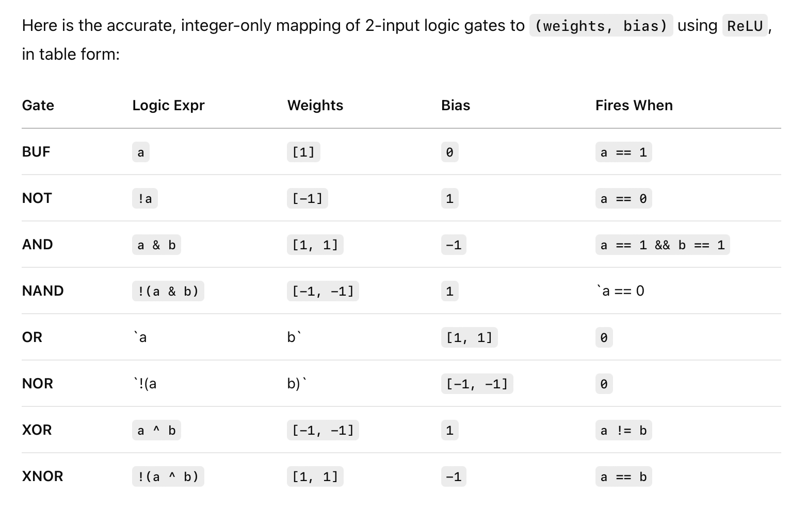

Dwarkesh Jane St problem
========================

Jane St problem from Dwarkesh podcast: https://x.com/dwarkesh_sp/status/1907886365565501568

http://jane-st.co/dwarkesh-puzzle

## Problem.

Today I went on a hike and found a pile of tensors hidden underneath a neolithic burial mound!
        
I sent it over to the local neural plumber, and they managed to cobble together this.

**[model.pt](https://huggingface.co/jane-street/2025-03-10/tree/main)**
            
Anyway, I'm not sure what it does yet, but it must have been important to this past civilization. 
Maybe start by looking at the last two layers. 

If you do figure it out, please let us know at *archaeology@janestreet.com*.
Learn more at [janestreet.com](https://jane-st.co/3YfP5WK)

## Problem breakdown.

 - `model.pt` is a serialised PyTorch model.
 - `python arch-analysis.py` will print the architecture of the model, found in `arch.txt`.

```
Sequential(
  (0): Linear(in_features=55, out_features=224, bias=True)
  (1): ReLU()
  (2): Linear(in_features=224, out_features=232, bias=True)
  (3): ReLU()
  (4): Linear(in_features=232, out_features=64, bias=True)
  (5): ReLU()
  (6): Linear(in_features=64, out_features=208, bias=True)
  (7): ReLU()
  (8): Linear(in_features=208, out_features=200, bias=True)
  ...
  (5438): Linear(in_features=192, out_features=48, bias=True)
  (5439): ReLU()
  (5440): Linear(in_features=48, out_features=1, bias=True)
  (5441): ReLU()
)
```
 
  It's 5442 layers of a repeating [Linear perceptron](https://en.wikipedia.org/wiki/Perceptron#Definition) (Wx+b) -> ReLU pattern (activation). 
  
  The number of outputs of the layers is logged in `seq.txt`. You can get a sense of the patterns in the sequence from this bar chart of the dimensionality of each linear layer.

 

## Second sprint.

 - the network is digital/binary circuit
 - observe `unq-weight-bias-set.txt` from `acivations.py`, which shows all the values of weights are power of 2 integers in interval [256.0,256], and biases are integers in interval [256.0,256]
 - the circuit resembles a DES cipher. in fact, at layer 6 there is a constant which is a DES test vector (it's a key)
 - I wrote a hand-written decompiler in `decompiler.py` to originally find this DES constant. Here are some notes on it:
```py
# inside layer 6, there is a bias of 0x80c4a2e691d5b3f77f3b5d196e2a4c08
# def l6_g(x: np.ndarray) -> np.ndarray:
# Splitting this bias into 2, 80c4a2e691d5b3f7 and 7f3b5d196e2a4c08

# https://www.cse.iitb.ac.in/~puru/courses/resources/old-virtio/qemu/tests/unit/test-crypto-cipher.c
# {
#     /*
#      * Testing 'password' as plaintext fits
#      * in single AES block, and gives identical
#      * ciphertext in ECB and CBC modes
#      */
#     .path = "/crypto/cipher/des-ecb-56-one-block",
#     .alg = QCRYPTO_CIPHER_ALGO_DES,
#     .mode = QCRYPTO_CIPHER_MODE_ECB,
#     .key = "80c4a2e691d5b3f7",
#     .plaintext = "70617373776f7264",
#     .ciphertext = "73fa80b66134e403",
# },
```
 - the decompiler does some loop re-rolling, which makes it easier to understand the layers.
 - **the decompiler is parity with the network, meaning `decompiledf(x) == f(x)`**. `analysis/layers2/single.py` (needs to be generated) will run the entire network.

Current objectives:

 * learning how a digital circuit is compiled to a neural net from chatgpt. see [`symbolic/symbolic.md`](./symbolic/symbolic1.md)
 * writing a second decompiler, `reverse.py` based on reversing the neural network back into its symbolic form (SSA's, etc).

Basically reversing this:


Once we have the SSA form, covered all the patterns, then we can repeat a couple of iterations:

 - weights and biases
 - single static assignment with binary logic operators - identity, not, and, or, xor

## First sprint.
 
 - Hypothesis 1: this model is a **neural hash function**. Some arguments why:
   - The hint says look at the last two layers. The last two layers are Linear layers with dimension of 192 and 48. These are the same sizes of hash function outputs - 192 bits, 48 bits.
   - **Evidence 1**:. Although the layers output vectors of `np.float32`, looking at the outputs they are in fact integers. See `test_hash_fn` in `js.py` to introspect these outputs. 
     - This would imply they are in fact 192 bit and 48 bit integers, suitable for a hash function.
     - **Question: are the outputs for different inputs uniformly distributed? Do they show locality (e.g. locality-sensitive hash)?**
   - **Hypothesis**: this network functions like a one-way compression function. Looking at the picture, the network has [absorbing-squeezing](https://keccak.team/sponge_duplex.html) phases where the linear dimensions are increased then reduced. The ReLu adds nonlinearity.
   - The input to this model, a vector of 55 floats, is mapped to a hash of 192 or 48 bits. Perhaps the vector is an output embedding of another model, e.g. cross-attention style.
 - Hypothesis 2: this model is a binary classifier or doing regression (predicting a single continuous value).
   - **Questions**: for what inputs does this model produce a non-zero output? (ie. not 0.0). 
   - The final Linear(48, 1) layer strongly indicates that the network's purpose is either binary classification (outputting a single logit) or regression (predicting a single continuous value). **However**, based on the purely linear architecture it feels more likely this is a red herring. Although - suitably deep neural networks can approximate any function.

Other observations:

 * Weights and biases.
   * `activations.py` prints the weights and biases for random 4 perceptrons for all the layers.
   * Read them in `weights-biases.txt`.
   * **Values are all integers**: [-1, 0, 1]
   * In terms of indices of the 1/-1, the weights are **sparse**. They are **NOT** one-hot encoded - **there is > 1 non-zero weight per perceptron**. 
   * This definitely **implies bitwise logic** is the core of the neural network.
 * Model architecture.
   * Unique dimensions (n=47): `{256, 1, 399, 400, 402, 404, 408, 410, 412, 287, 288, 160, 416, 296, 304, 432, 48, 55, 312, 440, 316, 444, 318, 319, 64, 192, 320, 446, 200, 328, 204, 332, 208, 336, 212, 340, 216, 220, 222, 223, 224, 352, 228, 232, 368, 375, 382}`
   * Layer sizes (ordered least to most frequent):
```txt
1: 1
287: 1
48: 1
55: 1
64: 1
446: 1
200: 1
204: 1
228: 1
382: 1
416: 2
432: 2
440: 2
444: 2
212: 2
222: 2
223: 2
232: 2
320: 3
224: 3
160: 4
208: 4
216: 4
220: 4
192: 14
368: 16
328: 31
296: 32
336: 47
399: 63
400: 63
402: 63
408: 63
410: 63
332: 63
340: 63
352: 63
375: 63
404: 126
412: 126
319: 127
304: 128
312: 128
316: 128
318: 128
256: 257
288: 819
```

Open research directions:

 1. Motifs. The network's structure (see image) is very repetitive. Ideally we can find the patterns to express it easily - though there are 5442 layers, so this is not manual labour.
    
    1. **Gemini**. I've used Google Gemini which has identified some motifs. `IB -> [A -> B -> C] * 7 -> [A' -> B -> C] * 5 -> [A'' -> B -> C] * 5 -> FB`, where `A` is a variable of some number of linear layers of different sizes. The numbers are somewhat correct (see `motif-gemini.py`), but fail to account for more than 50% of the layers.

    2. **Exhaustive search**. I've used an exhaustive search across `seq.txt` which tries to identify the hierarchical repeating motifs in the structure. This is the best I have so far - it outputs an accurate grammar of the entire neural network. Though it's not clean. 

 2. **Reverse-engineering**. 

    1. Could we see what inputs activate the model uniformly? Instead of adjusting the weights, could we compute the gradient with respect to the inputs `x` and adjust it in the direction of more activation?

## Scratchpad.

 - training a bitshift neural net.


## Install.

**NOTE: The .pt file requires python 3.9.**

```sh
# Install conda
wget https://repo.anaconda.com/miniconda/Miniconda3-latest-MacOSX-x86_64.sh -O ~/miniconda.sh
bash ~/miniconda.sh -b -p $HOME/miniconda

# install python3.9 (IMPORTANT FOR .PT parsing)
source $HOME/miniconda/bin/activate
conda init --all
conda create --name py39 python=3.9
conda activate py39

which -a pip
# rm any virtualenvs
# pip should only refer to 

pip install numpy torch cloudpickle
```

## Setup

1. Download `model.pt` to `js.pt`.

